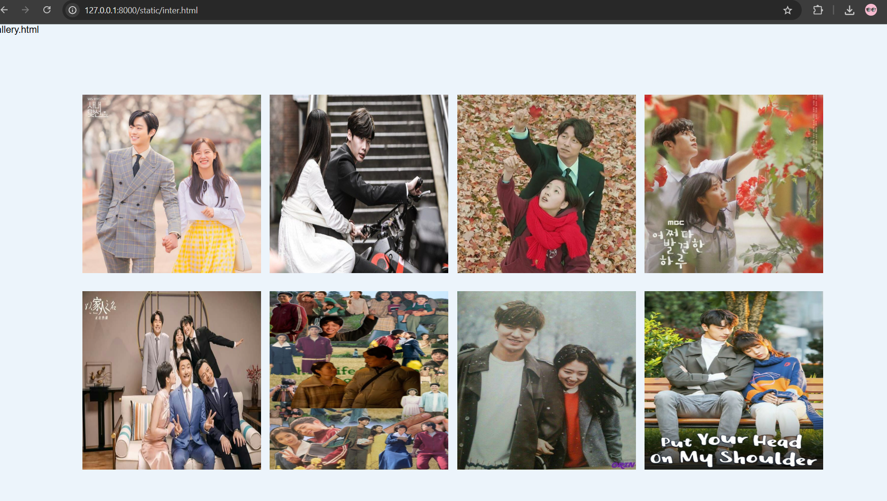

# Ex.08 Design of Interactive Image Gallery
## Date:

## AIM:
To design a web application for an inteactive image gallery with minimum five images.

## DESIGN STEPS:

### Step 1:
Clone the github repository and create Django admin interface.

### Step 2:
Change settings.py file to allow request from all hosts.

### Step 3:
Use CSS for positioning and styling.

### Step 4:
Write JavaScript program for implementing interactivity.

### Step 5:
Validate the HTML and CSS code.

### Step 6:
Publish the website in the given URL.

## PROGRAM :
```gallery.html
<!DOCTYPE html>
<html lang="en">
<head>
    <meta name="viewport" content="width=device-width, initial-scale=1.0">
    <title>Image Gallery</title>
    <link rel="stylesheet" href="gallery styles.css">
</head>
<body>
    <div class="full-img" id="fullImgBox">
        
        <span onclick="closeFullImg()">X</span>
    </div>
    <div class="img-gallery">
        
        
        
        
        
        
        
        
    </div>


<script>

    var fullImgBox = document.getElementById("fullImgBox");
    var fullImg = document.getElementById("fullImg");

    function openFullImg(pic){
        fullImgBox.style.display = "flex";
        fullImg.src = pic;
    }

    function closeFullImg(){
        fullImgBox.style.display = "none";
    }
</script>   
</body>
</html>

gallery style.css
*{
    margin: 0;
    padding: 0;
    font-family: sans-serif;
}
body{
    background: #ecf4fb;
}
.img-gallery{
    width: 80%;
    margin: 100px auto 50px;
    display: grid;
    grid-template-columns: repeat(auto-fit, minmax(250px, 1fr));
    grid-gap: 30px;
}
.img-gallery img{
    width: 300px;
    height: 300px;
    cursor: pointer;
}

.img-gallery img:hover{
    transform: scale(0.8) rotate(-15deg);
    border-radius: 20px;
    box-shadow: 0 32px 75px rgba(68,77,136, 0.2)
}

.full-img{
    width: 100%;
    height: 100vh;
    background: rgba(0,0,0,0.9);
    position: fixed;
    top: 0;
    left: 0;
    display: flex;
    align-items: center;
    justify-content: center;
    z-index: 100;
}
.full-img img{
    width: 90%;
    max-width: 500px;
}
.full-img span{
    
    position: absolute;
    top: 5%;
    right: 5%;
    font-size: 30px;
    color: #fff;
    cursor: pointer;
}
```

## OUTPUT:

## RESULT:
The program for designing an interactive image gallery using HTML, CSS and JavaScript is executed successfully.
